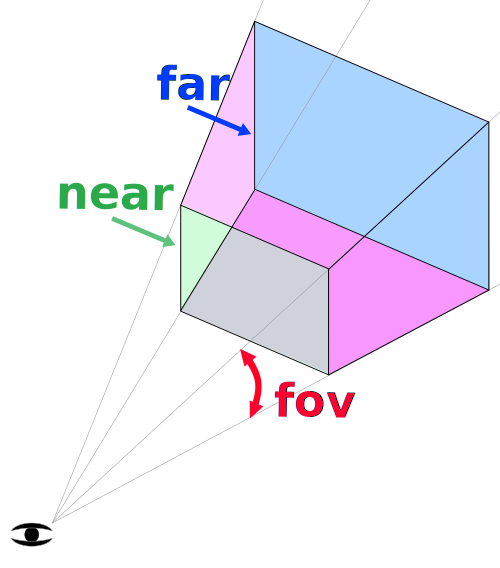

# Threejs-Workshop
This is a small project for a hands on workshop. The goal is to get to know Threejs and get your hands on some basics.

# Intro
Small Presentation:
- What is Three.js
- BiBaBoulder 
- Final Projects

# Getting Started
1. Download the repository
2. run npm install
3. run npm start

# Libraries in use
## Three.js
[Three.js](https://www.npmjs.com/package/three)  
The official Website [Website](https://threejs.org/)
The defacto standard 3D Library for web.
- The manual is here: [Manuel](https://threejs.org/manual/)
- Lots of examples: [Examples](https://threejs.org/examples/)

## Stats
[Stats.js](https://www.npmjs.com/package/statsjs)  
measure the frames per second

## Lil-gui
[Debug-UI](https://www.npmjs.com/package/lil-gui)  
Lightweight, easy to use Debug Menu. You can find a guide here: [Lil-GUI Guide](https://lil-gui.georgealways.com/#Guide)

## Color Palette
Generated with [Khroma](https://www.khroma.co/generator)  
Used to pick the colors for this project.

This workshop uses Images and code provided by Three.js and JoltPhysics.

# Project 1
- Basic Camera
- 3D Model import / export
- Interaction with Objects

## Camera
1. Create Camera
    - 
2. Create Object
    - Cube
    - MeshBasicMaterial
4. Add Light
    - why does the light not work?
5. Change the Material
    - MeshPhongMaterial
    

# Project 2
- OrbitCamera
- Physics interaction
- Add-ons / Plugins
## Step by Step
1. Add Orbit Controls
    - https://threejs.org/docs/?q=orbit#OrbitControls

# Project 3
- Write your own Shader
