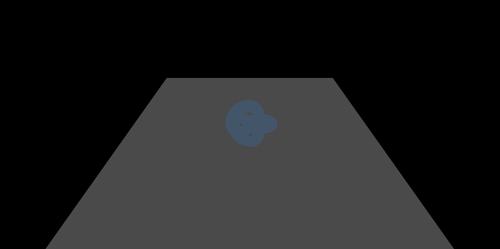
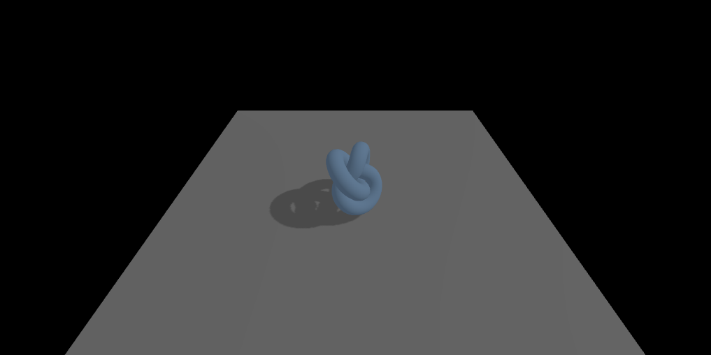
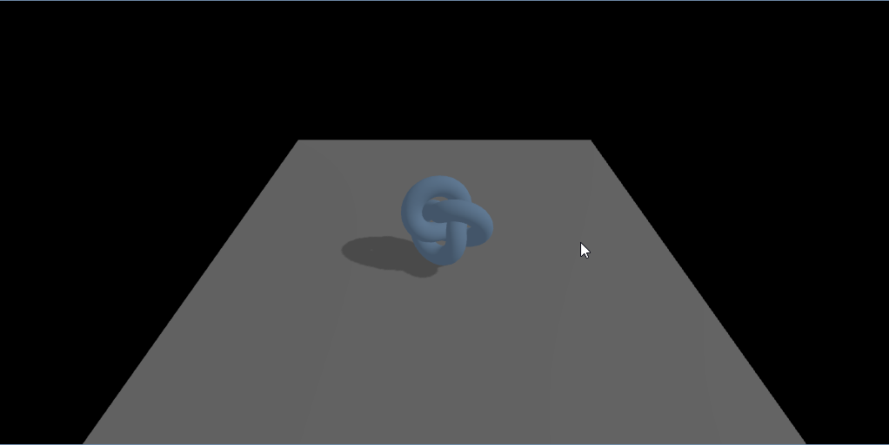

# Basic Camera
First we start out with a basic camera. A camera has a few parameters best explained with an image.


Lets add a camera in the `main()` method.
```javascript
function main() {  // exists already 
  ...  // exists already 
  renderer.shadowMap.enabled = true;  // exists already 
  scene = new THREE.Scene();  // exists already 

  const fov = 75;
  const aspect = 2;
  const near = 0.01;
  const far = 50;
  camera = new THREE.PerspectiveCamera(fov, aspect, near, far);
  camera.position.y = 4 ;
  camera.position.z = 4;
  camera.lookAt(0, 0, 0);

  renderer.render(scene, camera);
  renderer.domElement.addEventListener( 'pointermove', onPointerMove );

  addLight(scene); // exists already 
```

> [!TIP]
> Once we have something to see, try another camera besides PerspectiveCamera for example the OrthographicCamera

## light
In order to see any objects we need to add light to the scene. Add an ambient light to the `addLight(scene: THREE.Scene)` method

```javascript
function addLight(scene: THREE.Scene) { // exists already 
  ambientLight = new THREE.AmbientLight(0xFFFFFF, 1);
  scene.add(ambientLight);
}
```


# Add something to see
We now have a camera but we don't see anything. Now we add a floor plane and an object above the floor. Find the `addFloor(scene: THREE.Scene)` method and create a plane. Also add a TorusKnot (plain boxes are boring) in the `addShape(scene: THREE.Scene)` method

```javascript
function addFloor(scene: THREE.Scene) { // exists already 
  const floorSize = 10;
  const floorGeometry = new THREE.PlaneGeometry(floorSize, floorSize);
  const floorMaterial = new THREE.MeshStandardMaterial({ color: 0x808080, roughness: 0.8 });
  const floor = new THREE.Mesh(floorGeometry, floorMaterial);
  floor.position.y = -1;
  floor.rotation.x = -Math.PI / 2;
  floor.receiveShadow = true;
  scene.add(floor);
}
```

```javascript
function addShape(scene: THREE.Scene) { // exists already 
  const geometry = new THREE.TorusKnotGeometry(0.5, 0.2, 100, 16);
  const material = new THREE.MeshStandardMaterial({ color: basicColor });
  const mesh = new THREE.Mesh(geometry, material);
  mesh.castShadow = true;
  scene.add(mesh);
  meshes.push(mesh);
  meshToGroup.set(mesh, mesh);
}
```

You should now have something to see. The scene should now look like this.


# Directional light
Our scene looks very 1-Dimensional. That is because we have only an ambient light. Ambient light does light up all objects evenly without any highlights. There are no shadows and no light and dark spots on objects. With a directional light (a spotlight, the sun etc.) we can add some depth. Extend the `addLight(scene: THREE.Scene)` method.

```javascript
function addLight(scene: THREE.Scene) { // exists already 
  ambientLight = new THREE.AmbientLight(0xFFFFFF, 1); // exists already 
  scene.add(ambientLight); // exists already 

  light = new THREE.DirectionalLight(lightColor, lightIntensity);
  light.position.set(Math.cos(lightAngle) * lightRadius, 10, Math.sin(lightAngle) * lightRadius);
  light.castShadow = true;
  scene.add(light);
}
```

> [!TIP]
> Try a different material on your shapes and see what changes. Try MeshBasicMaterial and MeshNormalMaterial. See that the MeshBasicMaterial goes back to rendering the objects without the directional ligths. This is because the shader ignores complex lights.

# Camera moving
To move the camera around, we'll listen to the keyboard inputs. Let's add some listeners to fill the Set I have prepared:
```javascript
const keysPressed = new Set<string>(); // exists already 
window.addEventListener('keydown', (e) => keysPressed.add(e.code));
window.addEventListener('keyup', (e) => keysPressed.delete(e.code));
```

## Moving the camera around
Now we can manipulate the camera position via keyboard. I suggest WASD for moving around and Q and E for moving up and down. Find the `updateCamera()` function and fill it.
```javascript
function updateCamera() { // exists already 
  if (!camera) return;
  camera.getWorldDirection(cameraForward);
  cameraForward.y = 0;
  cameraForward.normalize();
  cameraRight.crossVectors(cameraForward, up).normalize();

  if (keysPressed.has('KeyW')) {
    camera.position.addScaledVector(cameraForward, cameraSpeed);
  }

  if (keysPressed.has('KeyS')) {
    camera.position.addScaledVector(cameraForward, -cameraSpeed);
  }

  if (keysPressed.has('KeyA')) {
    camera.position.addScaledVector(cameraRight, -cameraSpeed);
  }

  if (keysPressed.has('KeyD')) {
    camera.position.addScaledVector(cameraRight, cameraSpeed);
  }

  if (keysPressed.has('KeyQ')) {
    camera.position.y -= cameraSpeed;
  }

  if (keysPressed.has('KeyE')) {
    camera.position.y += cameraSpeed;
  }
}

```

> [!TIP]
> You can try adding camera rotation if you want an extra challenge (We are looking down with an angle, if you are confused why it will not rotate as you might think).

# Animation
Our testobject is quite static. We could add a screenshot and it would be more compatible with old devices. You would not see the difference. Lets add some animation in the `animate(time: number)` method. We can manipulate objects position and rotation directly be overwriting the values.

```javascript
function animate(time: number) { // exists already 
  time *= 0.001;  // convert time to seconds
  
  if (rotateObjects) {
    const groups = new Set(meshToGroup.values());
    for (let i = 0; i < groups.size; i++) {
      const group = Array.from(groups)[i];
      if (i === 0) {
        group.rotation.x = time;
      }
      group.rotation.y = time;
    }
  }
}
```

When done properly we should now see our Torus rotating


# 3D Model import / export
These primitives are good to get started and we could define our own shapes by hand. But that gets confusing very quickly. For that we have 3D Object file formats. I've already included a list of animals from [Kenney](https://kenney.nl/assets/cube-pets). I've already added the GLTF Loader addon.

## Adding import functionality
Let's go ahead and create a loader above the `importModel()` method:
```javascript
const gltfLoader = new GLTFLoader();

function importModel() { // exists already 
```

## Referencing files from our file system
To add objects to our virtual scene we have to load them from disc. We are still in a browser window so the way to do this is via html input.
```javascript
function importModel() {
  const input = document.createElement('input');
  input.type = 'file';
  input.accept = '.glb,.gltf';
  input.onchange = () => {
    const file = input.files?.[0];
    if (!file) {
      return;
    }
  };
  input.click();
}
```

## Adding files to scene
Now we can reference files from disc but we still have to add them to our virtual scene. This is done with the FileReader and the gltfLoader. We have to read the file first and then parse it to get valid gltf files out of it. There are other loaders like Obj and FBX alreadyd prebuilt.

```javascript
    if (!file) { // exists already 
      return; // exists already 
    } // exists already 

    const reader = new FileReader();
    reader.onload = (event) => {
      const data = event.target!.result as ArrayBuffer;
      gltfLoader.parse(data, '/GLB format/', (gltf) => {
        const model = gltf.scene;
        
        model.traverse((child) => {
          if ((child as THREE.Mesh).isMesh) {
            const mesh = child as THREE.Mesh;
            mesh.castShadow = true;
            mesh.receiveShadow = true;
            meshes.push(mesh);
            meshToGroup.set(mesh, model);
          }
        });
        scene!.add(model);
      });
    };
    reader.readAsArrayBuffer(file);
  }; // exists already 
  input.click(); // exists already 
```

> [!TIP]
> Extra challenge. Download another set of gltf files and try adding them.

# Interaction with Objects
Finally, we add some interaction with models. Otherwise this is just a computationally intensive video.

## Mouse Events
To have a meaningfull interaction we first need to know, if we are pressing a mouse button. Add 2 new events under the keyboard events:

```javascript
const keysPressed = new Set<string>(); // exists already 
window.addEventListener('keydown', (e) => keysPressed.add(e.code)); // exists already 
window.addEventListener('keyup', (e) => keysPressed.delete(e.code)); // exists already 
let isPointerDown = false;
let draggedGroup: THREE.Object3D | null = null;
window.addEventListener('pointerdown', (e) => {
  isPointerDown = true;
});
window.addEventListener('pointerup', (e) => {
  isPointerDown = false;
  draggedGroup = null;
});
```

## Variables
We have already a method called `handleInteraction()` in which we are now adding the logic.  
Add some variables in front of the function for things we don't want to instaniate each frame:
```javascript
const raycaster = new THREE.Raycaster();
const dragPlane = new THREE.Plane(new THREE.Vector3(0, 1, 0), 1);
const dragIntersection = new THREE.Vector3();
```
A raycaster is basically a way to check which 3D objects are in the way between a virtual point A to point B. We can filter out objects we don't care about with layers. The THREE Docu is here [Raycaster](https://threejs.org/docs/#Raycaster)

## Raycasting per frame
We want to cast a ray each frame to check where we point our mouse to. We only care about the first thing we hit, that is why we only honor `intersects[0]?`. Besides the primitive object that is a single mesh we have imported models that are groups of meshes. That's why we need to work with meshToGroup.
```javascript
function handleInteraction() { // already there
  raycaster.setFromCamera(normalizedPointerPosition, camera!);
  const intersects = raycaster.intersectObjects(meshes);
  const hitMesh = intersects[0]?.object as THREE.Mesh | undefined;
  const hitGroup = hitMesh ? meshToGroup.get(hitMesh) ?? hitMesh : undefined;
  let dragOffsetY = 0;
...
```

### Debugging
You can always add an arrow debug line to see if your vectors are what you think they are:  
```javascript
const arrowHelper = new THREE.ArrowHelper(raycaster.ray.direction, raycaster.ray.origin, 10, 0xff0000);
scene?.add(arrowHelper);
```

## Indicating highlighting and clicking
To visually show that we can interact with an object, we swap the object material.

```javascript
  let dragOffsetY = 0; // already there

  const activeGroup = draggedGroup ?? hitGroup;
  const activeMeshes = activeGroup ? getMeshesInGroup(activeGroup) : [];

  for (const mesh of meshes) {
    if (activeMeshes.includes(mesh)) {
      if (!originalMaterials.has(mesh)) {
        originalMaterials.set(mesh, mesh.material);
      }
      mesh.material = isPointerDown ? pickMaterial : highlightMaterial;
    } else if (originalMaterials.has(mesh)) {
      mesh.material = originalMaterials.get(mesh)!;
      originalMaterials.delete(mesh);
    }
  }
```

It should now look like this:


## Adding dragging
Now lets do something with the added functionality. Lets move things around while we have them active.
```javascript
  let dragOffsetY = 0; // already there

  if (isPointerDown && !draggedGroup && hitGroup) {
    draggedGroup = hitGroup;
    dragOffsetY = hitGroup.position.y;
  }

  if (isPointerDown && draggedGroup) {
    if (raycaster.ray.intersectPlane(dragPlane, dragIntersection)) {
      draggedGroup.position.x = dragIntersection.x;
      draggedGroup.position.z = dragIntersection.z;
      draggedGroup.position.y = dragOffsetY;
    }
  }

  const activeGroup = draggedGroup ?? hitGroup; // already there
```