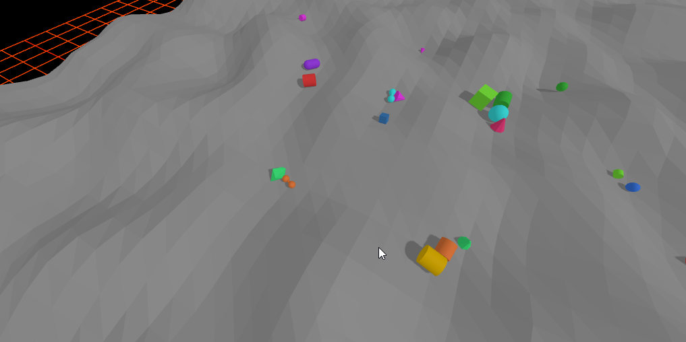
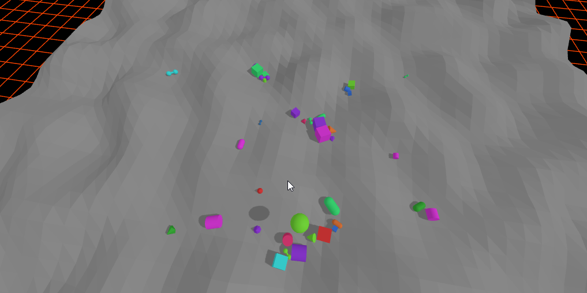

# Camera
We already used a camera in our first example. In this scene we don't want to move around we want to take a 360° look around our center. We could do this like we did with the WASD controlls but: There is already a premade camera control that can do this.

Let's start out by importing a new Addon: `OrbitControls` [Docs](https://threejs.org/docs/?q=orbit#OrbitControls)

```javascript
import { ImprovedNoise } from 'three/addons/math/ImprovedNoise.js'; // exists already 
import { OrbitControls } from 'three/addons/controls/OrbitControls.js';
import JoltPhysics from 'jolt-physics/wasm'; // exists already 
```

```javascript
function main() { // exists already 
  ... // exists already 
  addLight(scene); // exists already 

  controls = new OrbitControls(camera, renderer.domElement);
  controls.target.set(0, -4, -1);
  camera.position.set(0, 2, 9); // exists already 
  controls.update();
  renderer.render(scene, camera); // exists already 
  
  setupGui(); // exists already 
```

```javascript
function render(time: number) { // exists already 
  if (resizeRendererToDisplaySize(renderer!)) { // exists already 
    const canvas = renderer!.domElement; // exists already 
    camera!.aspect = canvas.clientWidth / canvas.clientHeight; // exists already 
    camera!.updateProjectionMatrix(); // exists already 
  } // exists already 
  
  controls!.update();
  renderer!.render(scene!, camera!); // exists already 
```

# Physics interaction
Use the Jolt Physics to explode shapes where the cursor points

## Spawn light at click position
Lets add some interaction in the `applyExplosion(center: THREE.Vector3)` method. We spawn a pointLight once and we'll update the position and animation. We do that because adding new lights is a very costly operation and can kill 3D scene performance.

Add the variables.
```javascript
let floorMesh: THREE.Mesh | undefined; // exists already 

let explosionLight: THREE.PointLight | undefined;
let explosionLightBorn = -Infinity;
const EXPLOSION_LIGHT_DURATION_IN_SECONDS = 0.6; // exists already 
```

Add the pointLight to the scene.
```javascript
function main() { // exists already 
  ... // exists already 
  addLight(scene); // exists already 
  
  explosionLight = new THREE.PointLight(0xff6600, 0, EXPLOSION_RADIUS * 3);
  explosionLight.castShadow = true;
  scene.add(explosionLight);
  controls = new OrbitControls(camera, renderer.domElement); // exists already 
  controls.target.set(0, -4, -1); // exists already 
```

Animate the pointlight so that it lightgs up for a brief period.
```javascript
function animate(time: number) { // exists already 
  time *= 0.001;  // convert time to seconds

  if (explosionLight && explosionLight.intensity > 0) { // exists already 
    const t = Math.min((time - explosionLightBorn) / EXPLOSION_LIGHT_DURATION_IN_SECONDS, 1); // exists already 
    explosionLight.intensity = EXPLOSION_LIGHT_INTENSITY * (1 - t) * (1 - t); // exists already 
  }

```


```javascript
function applyExplosion(center: THREE.Vector3) {
  if (explosionLight) {
    explosionLight.position.copy(center).y += 0.5;
    explosionLight.intensity = EXPLOSION_LIGHT_INTENSITY;
    explosionLightBorn = performance.now() / 1000;
  }
}
```

Now we should have something like this:


## Add physics
The light is nice but not very different compared to the interaction in the first example. Now lets enhance the `applyExplosion(center: THREE.Vector3)` method. We check all bodies in a radius and apply  an impulse and let the physics system workout the rest.

```javascript
function applyExplosion(center: THREE.Vector3) { // exists already 
  if (explosionLight) { // exists already 
    explosionLight.position.copy(center).y += 0.5; // exists already 
    explosionLight.intensity = EXPLOSION_LIGHT_INTENSITY; // exists already 
    explosionLightBorn = performance.now() / 1000; // exists already 
  } // exists already 

  for (const { body } of dynamicBodies) {
    const p = body.GetPosition();
    const bx = p.GetX(), by = p.GetY(), bz = p.GetZ();
    const dx = bx - center.x;
    const dy = by - center.y;
    const dz = bz - center.z;
    const distSq = dx*dx + dy*dy + dz*dz;
    if (distSq > EXPLOSION_RADIUS * EXPLOSION_RADIUS) {
      continue;
    }

    const dist = Math.sqrt(distSq) || 0.001;
    // Linear falloff; always push slightly upward even if object is right below
    const falloff = 1 - dist / EXPLOSION_RADIUS;
    const scale = EXPLOSION_STRENGTH * falloff / dist;
    const ix = dx * scale;
    const iy = Math.max(dy, 0.5) * scale;
    const iz = dz * scale;

    bodyInterface.ActivateBody(body.GetID());
    bodyInterface.AddImpulse(body.GetID(), new Jolt.Vec3(ix, iy, iz));
  }
}
```

> [!NOTE]
> Normally you would calculate the pythagorean distance with sqrt(a^2 + b^2) = c but in computer graphics we need performance. It is faster to just square c and leave the squareroot be. a^2 + b^2 = c^2.

And we are done. With the physics interaction it should look like this:
 